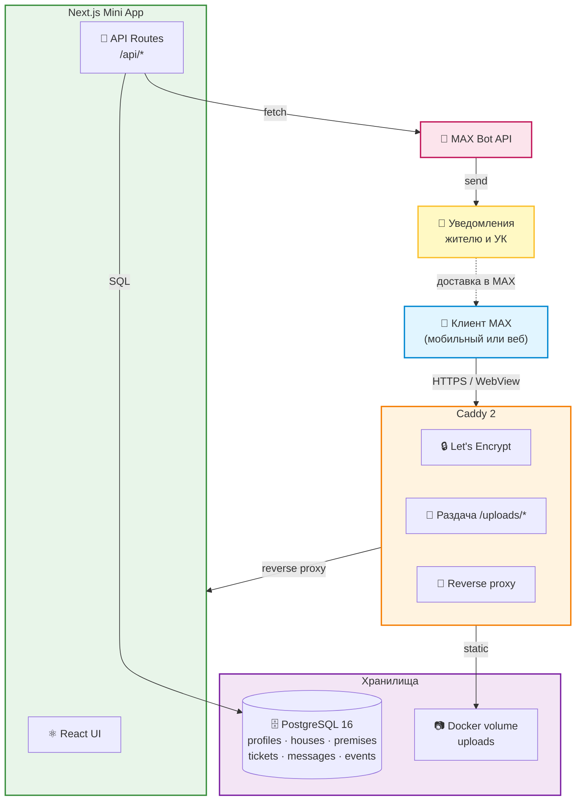
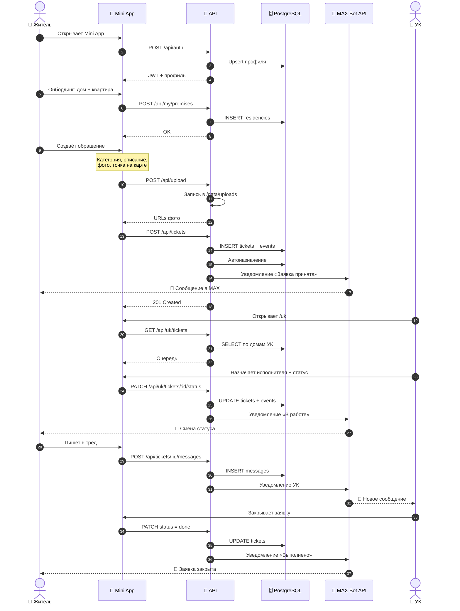
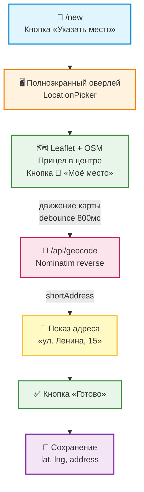
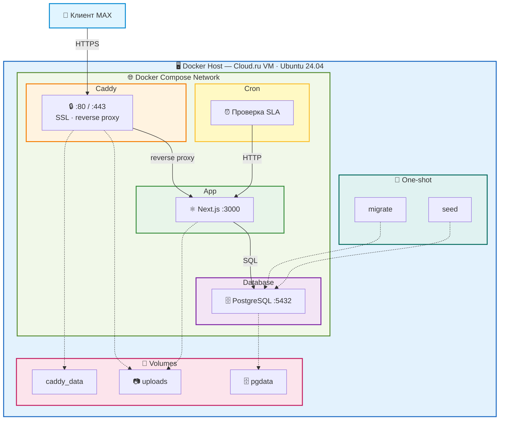
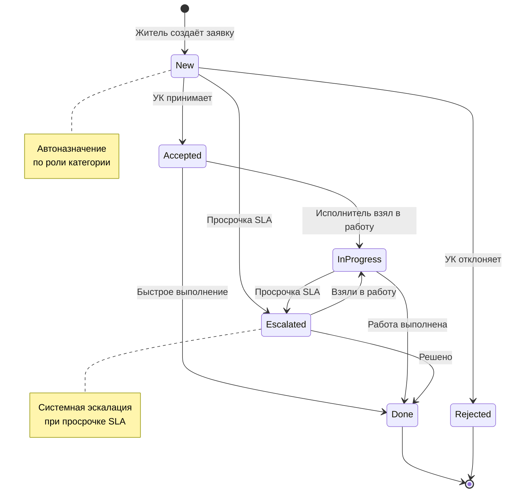
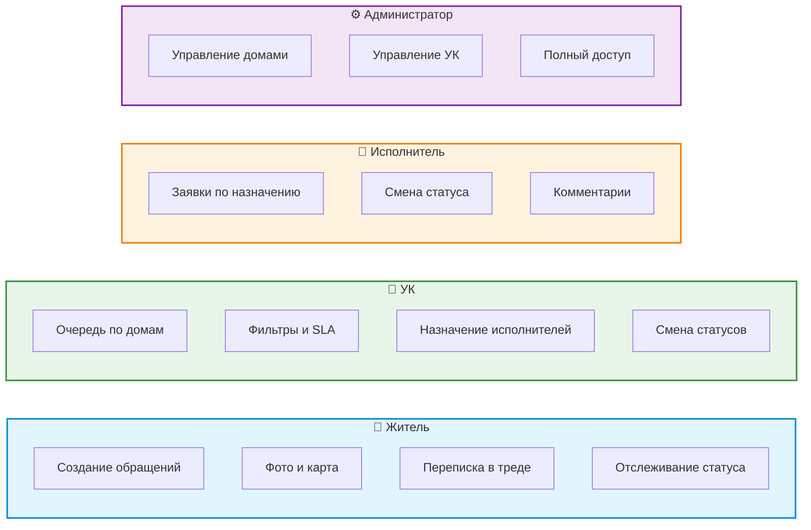
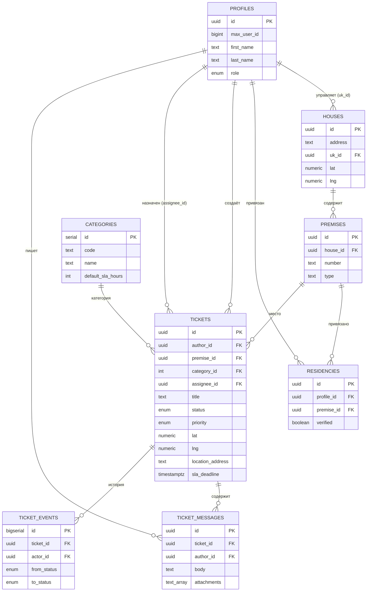

# ЖКХ в MAX

Сервис обращений жителей в сфере ЖКХ через мессенджер MAX.
Мини-приложение для жителей и кабинет для управляющих компаний.

---

## Содержание

- [О решении](#о-решении)
- [Основной сценарий](#основной-сценарий)
- [Архитектура](#архитектура)
- [Запуск](#запуск)
- [Конфигурация](#конфигурация)
- [Возможности](#возможности)
- [Данные](#данные)
- [Проверка сценария](#проверка-сценария)
- [Внешние сервисы](#внешние-сервисы)
- [Эксплуатация](#эксплуатация)

---

## О решении

С 1 сентября 2026 года управляющие компании обязаны взаимодействовать
с собственниками помещений через многофункциональный сервис MAX.
**ЖКХ в MAX** закрывает эту задачу: житель отправляет обращение за
30 секунд, а УК получает структурированную очередь заявок с контролем
сроков и прозрачными статусами.

**Ключевая ценность:**

- Житель решает вопрос без звонков и бумаг — прямо в мессенджере.
- УК видит все обращения в одном месте, с адресом, фото и картой.
- Процесс прозрачен для обеих сторон: статусы, сроки, переписка.

---

## Основной сценарий

### Житель

1. Открывает мини-приложение через бота MAX.
2. При первом входе указывает адрес — дом и квартиру.
3. Создаёт обращение: категория, описание, фото, точка на карте.
4. Получает уведомление о регистрации заявки в MAX.
5. Следит за статусом и общается с УК в треде заявки.
6. При смене статуса получает уведомление в мессенджере.

### УК

1. Открывает кабинет через профиль.
2. Видит очередь обращений по своим домам.
3. Фильтрует по статусу, приоритету, сроку SLA.
4. Назначает исполнителя и меняет статус заявки.
5. Ведёт переписку с жителем в едином треде.

---

## Архитектура

### Компоненты

| Компонент  | Технология    | Назначение                            |
| ------------------- | ----------------------- | ----------------------------------------------- |
| Mini App            | Next.js 15 (App Router) | Интерфейс жителя и УК         |
| API                 | Next.js Route Handlers  | REST API                                        |
| БД                | PostgreSQL 16           | Хранение данных                   |
| ORM                 | Drizzle                 | Схема и миграции                  |
| Веб-сервер | Caddy 2                 | HTTPS, отдача файлов, reverse proxy |
| Бот              | MAX Bot API             | Уведомления и точка входа |

### Роли

| Роль                   | Возможности                                                                                  |
| -------------------------- | ------------------------------------------------------------------------------------------------------- |
| Житель               | Создание обращений, переписка, отслеживание статуса        |
| УК                       | Очередь заявок, назначение исполнителей, смена статусов |
| Исполнитель     | Работа по назначенным заявкам                                                 |
| Администратор | Полный доступ к системе                                                             |

### Общая схема системы



### Сценарий работы системы



### Поток данных при создании заявки

```mermaid
flowchart LR
    A["📱 Mini App<br/>/new"] -->|1. multipart<br/>фото| B["🔌 API<br/>/api/upload"]
    B -->|2. запись| C["📷 /data/uploads/<br/>tickets/uuid.jpg"]
    C -->|3. URL| B
    B -->|4. urls[]| A

    A -->|5. POST JSON<br/>title, photos,<br/>lat, lng| D["🔌 API<br/>/api/tickets"]
    D -->|6. INSERT| E[("🗄️ tickets")]
    D -->|7. INSERT| F[("📋 events")]
    D -->|8. автоназначение| G[("👤 assignee")]
    D -->|9. notify| H["🤖 MAX Bot API"]
    D -->|10. 201 ticket| A

    style A fill:#e1f5ff,stroke:#0288d1,stroke-width:2px
    style B fill:#e8f5e9,stroke:#388e3c,stroke-width:2px
    style C fill:#fff3e0,stroke:#f57c00,stroke-width:2px
    style D fill:#e8f5e9,stroke:#388e3c,stroke-width:2px
    style E fill:#f3e5f5,stroke:#7b1fa2,stroke-width:2px
    style F fill:#f3e5f5,stroke:#7b1fa2,stroke-width:2px
    style G fill:#f3e5f5,stroke:#7b1fa2,stroke-width:2px
    style H fill:#fce4ec,stroke:#c2185b,stroke-width:2px
```

### Работа с картой



### Развёртывание



### Жизненный цикл заявки



### Роли и права



---

## Запуск

### Требования

- Docker ≥ 24
- Docker Compose ≥ 2.20

### Одна команда для запуска всех компонентов

```bash
docker compose up -d --build
```

### Первичная инициализация

```bash
docker compose run --rm migrate   # схема БД
docker compose run --rm seed      # стартовые данные
```

### Проверка

```bash
docker compose ps
```

Все сервисы (`db`, `app`, `caddy`, `cron`) — в статусе `running`.

---

## Конфигурация

### Файл `.env`

Размещается рядом с `docker-compose.yml`. Шаблон — в `.env.example`.

### Переменные окружения

| Переменная        | Назначение                         |
| --------------------------- | -------------------------------------------- |
| `APP_DOMAIN`              | Домен сервиса для Caddy       |
| `NEXT_PUBLIC_APP_URL`     | Публичный URL приложения  |
| `POSTGRES_USER`           | Пользователь БД                |
| `POSTGRES_PASSWORD`       | Пароль БД                            |
| `POSTGRES_DB`             | Имя базы                              |
| `APP_JWT_SECRET`          | Секрет для подписи JWT       |
| `MAX_BOT_TOKEN`           | Токен бота MAX                      |
| `MAX_WEBHOOK_SECRET`      | Секрет вебхука                  |
| `NEXT_PUBLIC_MAX_BOT_URL` | Ссылка на бота                   |
| `CRON_SECRET`             | Секрет для планировщика |

### Порты

| Порт | Назначение                       |
| -------- | ------------------------------------------ |
| 80       | HTTP (редирект)                    |
| 443      | HTTPS                                      |
| 5432     | PostgreSQL (внутренняя сеть) |
| 3000     | Next.js (внутренняя сеть)    |

Наружу открыты **только 80 и 443**.

---

## Возможности

### Для жителей

- **Быстрое создание обращения** — категория, описание, приоритет.
- **Фото до 5 штук** — с автоматическим сжатием на клиенте.
- **Место на карте** — точка с определением адреса.
- **Прозрачные статусы** — от «Новое» до «Выполнено».
- **Уведомления в MAX** — при регистрации и смене статуса.
- **Переписка с УК** — в едином треде заявки.

### Для управляющих компаний

- **Очередь обращений** по всем домам компании.
- **Фильтры** по статусу, приоритету, сроку SLA.
- **Назначение исполнителей** из справочника сотрудников.
- **Управление статусами** с историей изменений.
- **Контроль SLA** — подсветка просроченных заявок.
- **Автоназначение** по роли категории.

---

## Данные

### Схема БД

| Таблица      | Содержание                                    |
| ------------------- | ------------------------------------------------------- |
| `profiles`        | Пользователи системы                 |
| `houses`          | Реестр домов                                 |
| `premises`        | Квартиры и помещения                  |
| `residencies`     | Привязка жителей к помещениям |
| `categories`      | Категории обращений                   |
| `tickets`         | Обращения                                      |
| `ticket_messages` | Сообщения в тредах                      |
| `ticket_events`   | История изменения статусов      |

### Связи таблиц



### Файловое хранилище

Фотографии сохраняются в отдельный Docker volume и отдаются через
Caddy по защищённому пути `/uploads/*`.

### Миграции

```bash
docker compose run --rm migrate
```

### Стартовые данные

```bash
docker compose run --rm seed
```

Создаёт базовый реестр для проверки сценария:

- 8 категорий обращений (вода, отопление, электрика, лифт, кровля,
  мусор, придомовая территория, домофон).
- 5 домов с 40 квартирами в каждом.
- Профили управляющих компаний, исполнителей и тестового жителя.

---

## Проверка сценария

### 1. Открытие сервиса

Откройте `https://<APP_DOMAIN>` — увидите страницу входа в MAX.

### 2. Открытие мини-приложения

Через бота MAX откройте мини-приложение. При первом входе —
онбординг: выбор дома и квартиры.

### 3. Создание обращения

- Категория, заголовок, описание.
- Прикрепите 1–2 фотографии.
- Укажите место на карте.
- Нажмите «Отправить».

**Ожидаемое поведение:**

- Уведомление «Обращение отправлено».
- Заявка появляется в списке на главной.
- В MAX приходит сообщение от бота.

### 4. Просмотр заявки

Откройте заявку из списка. Видно:

- Статус и категорию.
- Адрес и карту.
- Фотографии.
- Поле для сообщений.

### 5. Работа управляющей компании

Через профиль откройте кабинет УК:

- Очередь обращений с фильтрами.
- Карточка заявки с действиями: назначение исполнителя, смена
  статуса, комментарий.
- Переписка с жителем.

При смене статуса автор получает уведомление в MAX, а в треде
появляется системное сообщение.

---

## Внешние сервисы

### MAX Bot API

Обеспечивает отправку уведомлений жителям и УК, а также приём
вебхуков от платформы. Точка входа в мини-приложение.

Для работы необходим аккаунт в MAX и зарегистрированный бот.

### Карты и геокодирование

Для указания места на карте используются открытые картографические
данные OpenStreetMap и сервис обратного геокодирования Nominatim.

Обеспечивают отображение карты, выбор точки и определение
человекочитаемого адреса по координатам.

---

## Эксплуатация

### Обновление

```bash
cd maxhackathon
git pull
cd ..
docker compose up -d --build
```

### Логи

```bash
docker compose logs -f app
docker compose logs -f caddy
docker compose logs -f db
docker compose logs -f cron
```

### Остановка

```bash
docker compose down          # сохраняет данные
docker compose down -v       # удаляет данные
```

### Повторный запуск

```bash
docker compose up -d
```

### Перезапуск отдельных сервисов

```bash
docker compose restart app
docker compose restart caddy
```

---

## Разработано для

Хакатона по цифровизации сферы ЖКХ.
Хостинг — Cloud.ru. Мини-приложение доступно в MAX через бота
команды.

---

## Лицензия

MIT.
