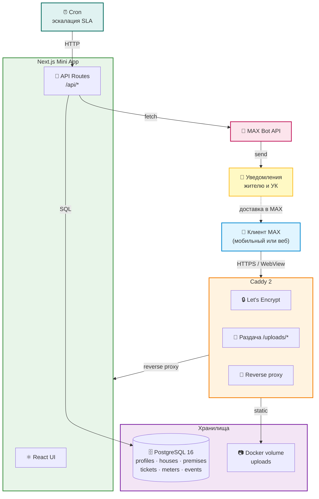
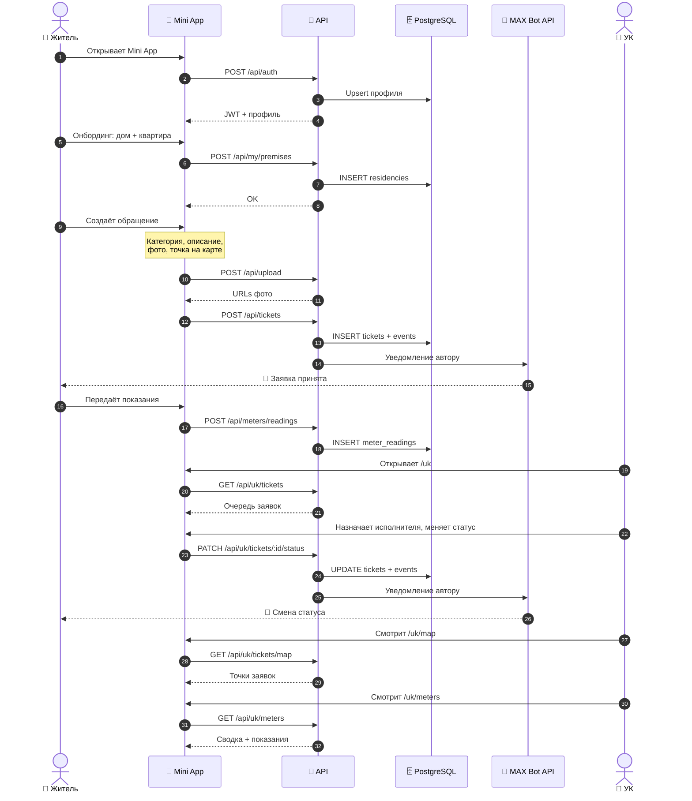
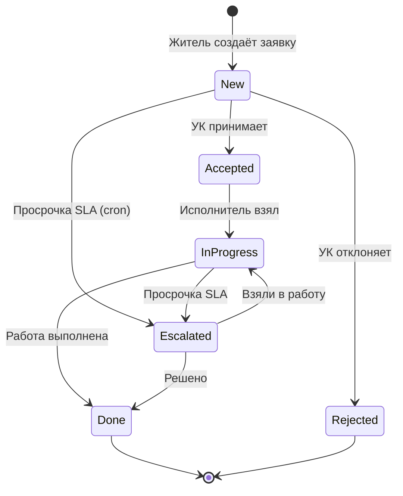
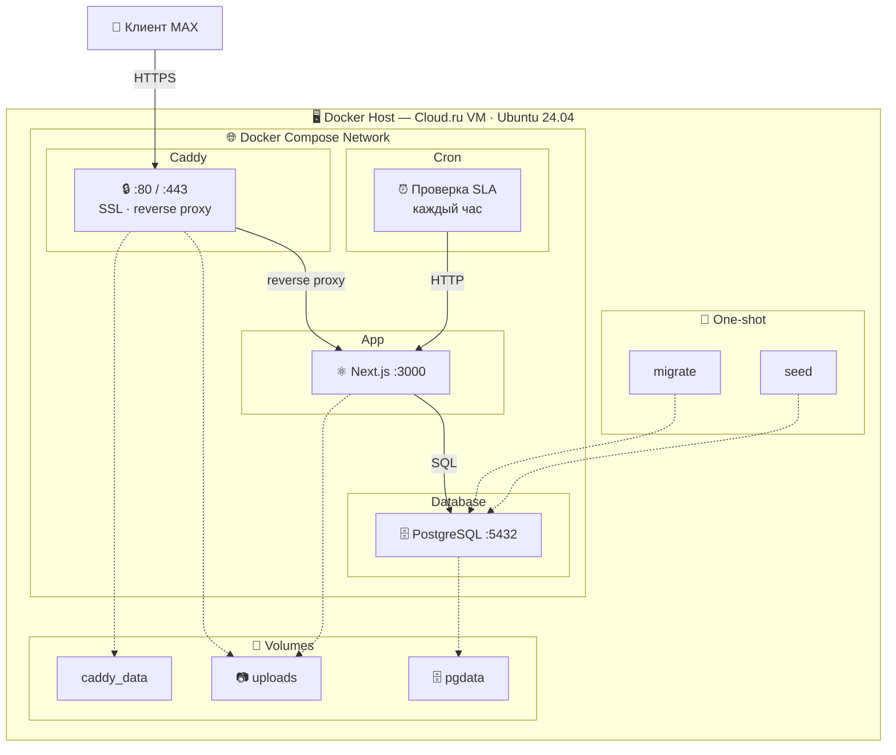
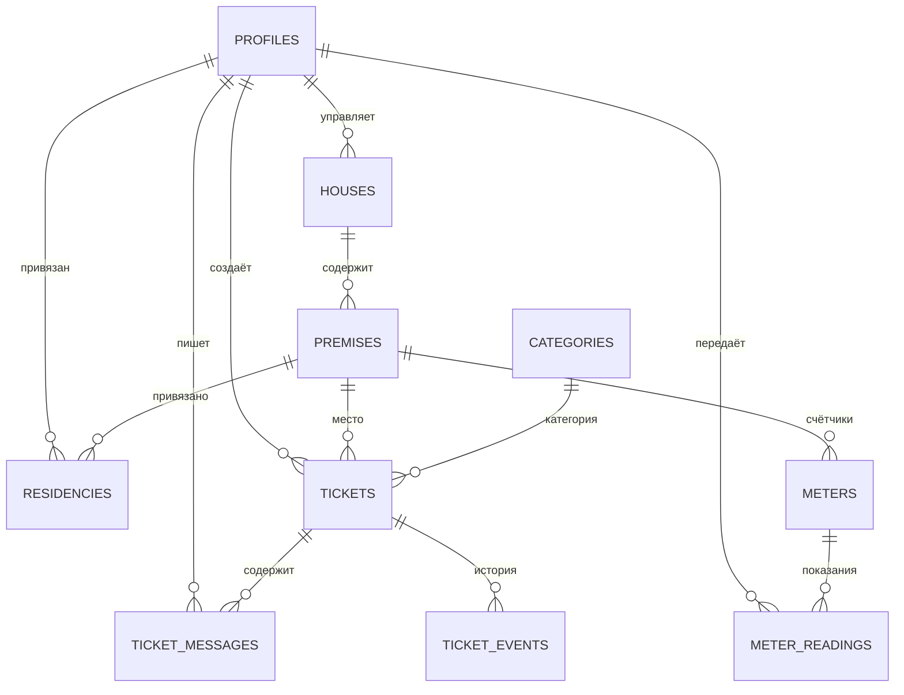

# ЖКХ в MAX

Сервис обращений жителей в сфере ЖКХ через мессенджер MAX.
Мини-приложение для жителей и кабинет для управляющих компаний.

---

## Содержание

- [О решении](#о-решении)
- [Основной сценарий](#основной-сценарий)
- [Архитектура](#архитектура)
- [Запуск](#запуск)
- [Конфигурация](#конфигурация)
- [Возможности](#возможности)
- [Данные](#данные)
- [Проверка сценария](#проверка-сценария)
- [Внешние сервисы](#внешние-сервисы)
- [Эксплуатация](#эксплуатация)

---

## О решении

С 1 сентября 2026 года управляющие компании обязаны взаимодействовать
с собственниками помещений через многофункциональный сервис MAX.
**ЖКХ в MAX** закрывает эту задачу: житель отправляет обращение за
30 секунд, а УК получает структурированную очередь заявок с контролем
сроков, прозрачными статусами, картой и данными по счётчикам.

**Ключевая ценность:**

- Житель решает вопрос без звонков и бумаг — прямо в мессенджере.
- УК видит все обращения, карту проблем и статусы счётчиков.
- Передача показаний и объявления — в одном приложении.
- Процесс прозрачен для обеих сторон: статусы, сроки, переписка.

---

## Основной сценарий

### Житель

1. Открывает мини-приложение через бота MAX.
2. При первом входе указывает адрес — дом и квартиру.
3. Создаёт обращение: категория, описание, фото, точка на карте.
4. Получает уведомление о регистрации заявки в MAX.
5. Следит за статусом и общается с УК в треде заявки.
6. Передаёт показания счётчиков и следит за их хронологией.
7. При смене статуса заявки получает уведомление.

### УК

1. Открывает кабинет через профиль или с главной.
2. Видит очередь обращений по своим домам.
3. Фильтрует по статусу, приоритету, сроку SLA.
4. Назначает исполнителя и меняет статус заявки.
5. Смотрит карту заявок и контролирует счётчики жителей.
6. Выгружает отчёты в CSV.
7. Ведёт переписку с жителем в едином треде.

---

## Архитектура

### Компоненты

| Компонент | Технология | Назначение |
|---|---|---|
| Mini App | Next.js 15 (App Router) | Интерфейс жителя и УК |
| API | Next.js Route Handlers | REST API |
| БД | PostgreSQL 16 | Хранение данных |
| ORM | Drizzle | Схема и миграции |
| Веб-сервер | Caddy 2 | HTTPS, отдача файлов, reverse proxy |
| Бот | MAX Bot API | Уведомления и точка входа |
| Планировщик | Alpine + crond | Эскалация SLA раз в час |

### Роли

| Роль | Возможности |
|---|---|
| Житель | Создание обращений, переписка, показания счётчиков |
| УК | Очередь заявок, назначение исполнителей, карта, счётчики, экспорт |
| Исполнитель | Работа по назначенным заявкам |
| Администратор | Полный доступ к системе |

### Общая схема системы



### Сценарий работы системы



### Жизненный цикл заявки



### Развёртывание



### Связи таблиц



---

## Запуск

### Требования

- Docker ≥ 24
- Docker Compose ≥ 2.20

### Одна команда для запуска всех компонентов

```bash
docker compose up -d --build
```

### Первичная инициализация

```bash
docker compose run --rm migrate   # схема БД
docker compose run --rm seed      # стартовые данные
```

### Проверка

```bash
docker compose ps
```

Все сервисы (`db`, `app`, `caddy`, `cron`) — в статусе `running`.

---

## Конфигурация

### Файл `.env`

Размещается рядом с `docker-compose.yml`. Шаблон — в `.env.example`.

### Переменные окружения

| Переменная | Назначение |
|---|---|
| `APP_DOMAIN` | Домен сервиса для Caddy |
| `NEXT_PUBLIC_APP_URL` | Публичный URL приложения |
| `POSTGRES_USER` | Пользователь БД |
| `POSTGRES_PASSWORD` | Пароль БД |
| `POSTGRES_DB` | Имя базы |
| `APP_JWT_SECRET` | Секрет для подписи JWT |
| `MAX_BOT_TOKEN` | Токен бота MAX |
| `MAX_WEBHOOK_SECRET` | Секрет вебхука |
| `NEXT_PUBLIC_MAX_BOT_URL` | Ссылка на бота |
| `CRON_SECRET` | Секрет для планировщика |
| `ALLOW_DEV_ENDPOINTS` | Включение dev-переключателя роли |

### Порты

| Порт | Назначение |
|---|---|
| 80 | HTTP (редирект) |
| 443 | HTTPS |
| 5432 | PostgreSQL (внутренняя сеть) |
| 3000 | Next.js (внутренняя сеть) |

Наружу открыты **только 80 и 443**.

---

## Возможности

### Для жителей

- **Быстрое создание обращения** — категория, описание, приоритет.
- **Фото до 5 штук** — с автоматическим сжатием на клиенте.
- **Место на карте** — точка с определением адреса.
- **Прозрачные статусы** — от «Новое» до «Выполнено».
- **Уведомления в MAX** — при регистрации и смене статуса.
- **Переписка с УК** — в едином треде заявки.
- **Показания счётчиков** — вода, электричество, газ.
- **Хронология показаний** — с расчётом потребления.

### Для управляющих компаний

- **Очередь обращений** по всем домам компании.
- **Метрики на дашборде** — новые, в работе, просрочено.
- **Фильтры и сортировка** по статусу, приоритету, SLA.
- **Назначение исполнителей** из справочника сотрудников.
- **Управление статусами** с историей изменений.
- **Карта всех заявок** — визуализация проблем.
- **Дашборд счётчиков** — статусы, последние показания, поиск.
- **Экспорт CSV** для отчётности.
- **Автоэскалация SLA** через cron.

---

## Данные

### Схема БД

| Таблица | Содержание |
|---|---|
| `profiles` | Пользователи системы |
| `houses` | Реестр домов |
| `premises` | Квартиры и помещения |
| `residencies` | Привязка жителей к помещениям |
| `categories` | Категории обращений |
| `tickets` | Обращения |
| `ticket_messages` | Сообщения в тредах |
| `ticket_events` | История изменения статусов |
| `meters` | Счётчики воды, электричества, газа |
| `meter_readings` | Показания счётчиков |

### Файловое хранилище

Фотографии сохраняются в отдельный Docker volume и отдаются через
Caddy по защищённому пути `/uploads/*`.

### Миграции

```bash
docker compose run --rm migrate
```

### Стартовые данные

```bash
docker compose run --rm seed
```

Создаёт базовый реестр:

- 8 категорий обращений (вода, отопление, электрика, лифт, кровля,
  мусор, придомовая территория, домофон).
- 5 домов с 40 квартирами в каждом.
- 3 счётчика в каждой квартире (ХВС, ГВС, электричество).
- Профили управляющих компаний, исполнителей и тестового жителя.

### Переключение роли для проверки

По умолчанию все пользователи — жители. Чтобы проверить сценарий УК:

1. Откройте профиль в Mini App.
2. Нажмите **«🔧 Стать УК»** (при `ALLOW_DEV_ENDPOINTS=true`).
3. Приложение перезагрузится — вы УК.

Вернуться обратно — **«👤 Стать жителем»** в том же блоке.

---

## Проверка сценария

### 1. Открытие сервиса

Откройте `https://<APP_DOMAIN>` — увидите страницу входа в MAX.

### 2. Онбординг жителя

Через бота MAX откройте Mini App. При первом входе — выбор дома
и квартиры.

### 3. Создание обращения

- Категория, заголовок, описание.
- Прикрепите 1–2 фотографии.
- Укажите место на карте.
- Нажмите «Отправить».

**Ожидаемо:**

- Уведомление «Обращение отправлено».
- Заявка появляется в списке на главной.
- В MAX приходит сообщение от бота.

### 4. Просмотр заявки

Откройте заявку. Видно: статус, категорию, адрес, карту, фото,
поле для сообщений.

### 5. Работа управляющей компании

Из профиля откройте **Кабинет УК**:

- Сводные метрики сверху.
- Очередь обращений с фильтрами и сортировкой.
- Быстрые действия в карточках.
- Кнопка **«Карта заявок»** — все точки на карте.
- Кнопка **«Счётчики по домам»** — дашборд со статусами.
- Кнопка **«Скачать CSV»** — выгрузка заявок.

### 6. Показания счётчиков

**Житель** открывает с главной **«Показания счётчиков»**:

- Видит три счётчика своей квартиры.
- Передаёт новые показания.
- Раскрывает **хронологию** с потреблением.

**УК** открывает **«Счётчики по домам»**:

- Сводка: просрочено / скоро срок / ок.
- Поиск по адресу или квартире.
- По каждой квартире — последние показания и статус.

### 7. Автоэскалация SLA

Каждый час cron дёргает `/api/cron/sla`:

- За час до SLA — предупреждает исполнителя.
- При просрочке — эскалирует заявку и уведомляет обе стороны.

---

## Внешние сервисы

### MAX Bot API

Отправка уведомлений жителям и УК, приём вебхуков, точка входа
в мини-приложение. Требуется аккаунт в MAX и зарегистрированный бот.

### OpenStreetMap + Nominatim

Карты и обратное геокодирование (координаты → адрес). Работают
без API-ключей.

### Docker Hub

Базовые образы: `postgres:16-alpine`, `caddy:2-alpine`,
`node:20-alpine`, `alpine:3.19`.

---

## Эксплуатация

### Обновление

```bash
cd maxhackathon
git pull
cd ..
docker compose up -d --build
```

### Логи

```bash
docker compose logs -f app
docker compose logs -f caddy
docker compose logs -f cron
docker compose logs -f db
```

### Остановка

```bash
docker compose down          # сохраняет данные
docker compose down -v       # удаляет данные
```

### Повторный запуск

```bash
docker compose up -d
```

### Бэкап БД

```bash
docker compose exec -T db pg_dump -U zhkh zhkh | gzip > backup-$(date +%F).sql.gz
```

### Бэкап файлов

```bash
docker run --rm -v app_uploads:/data -v $(pwd):/backup \
  alpine tar czf /backup/uploads-$(date +%F).tar.gz -C /data .
```

---

## Разработано для

Хакатона по цифровизации сферы ЖКХ.
Хостинг — Cloud.ru. Мини-приложение доступно в MAX через бота
команды.

---

## Лицензия

MIT.